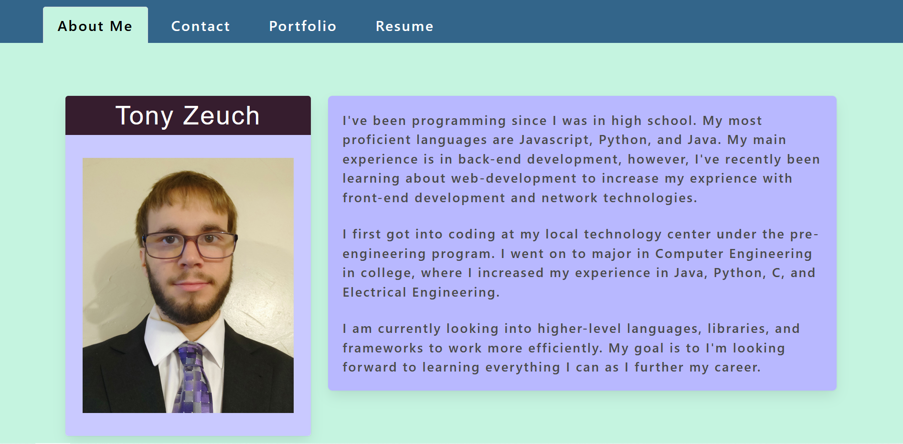
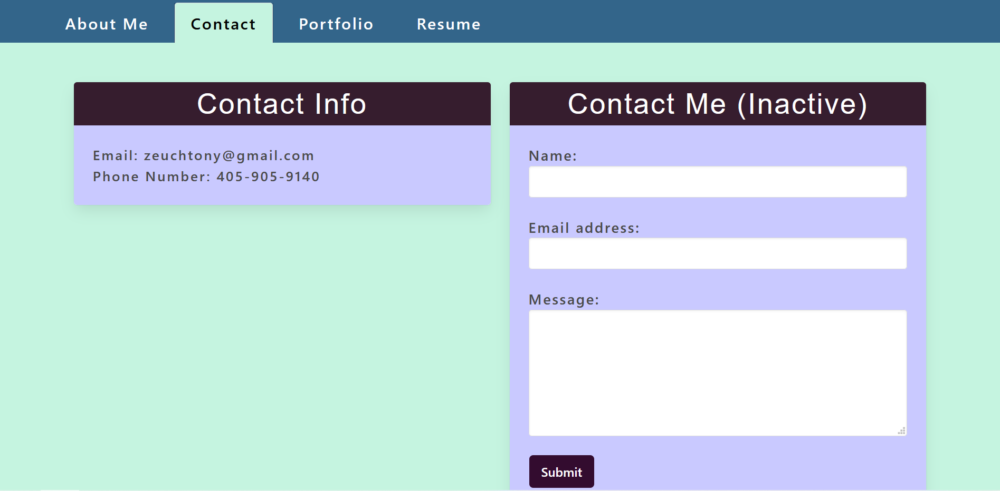
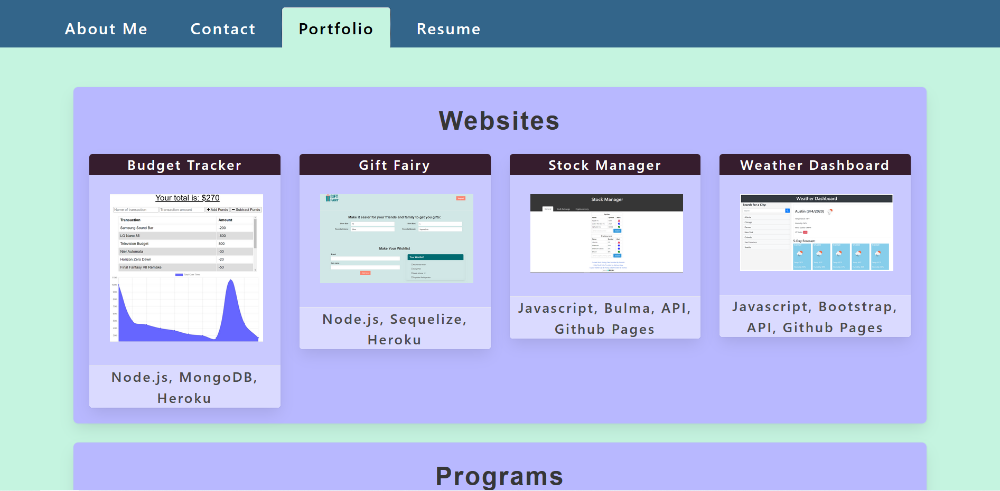
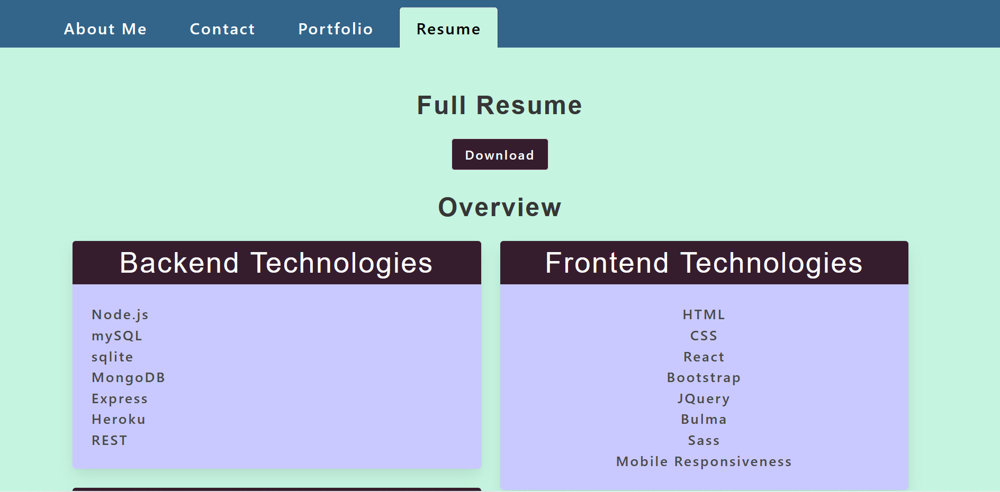

# React Portfolio
Web application built in react to showcase what I've learned.

## Features
* About Me section describes my background.
* Contact section gives information on how to contact me.
* Portfolio section showcases projects that I've done in the past.
* Resume section give a brief list of skills for an employer to scan through as well as a downloadable resume.
* Doesn't need to open a new page or refresh when changing sections due to react.

## Potential Future Upgrades
* Add in ability to submit form on contact page.
* Make a small edit to a previous application on portfolio section. (Bulma updated and messed up visuals a little)
* Add a button to view resume, in case user doesn't want to specifically download it.

## Screenshot

## Website
https://tzeuch0922.github.io/react-portfolio/